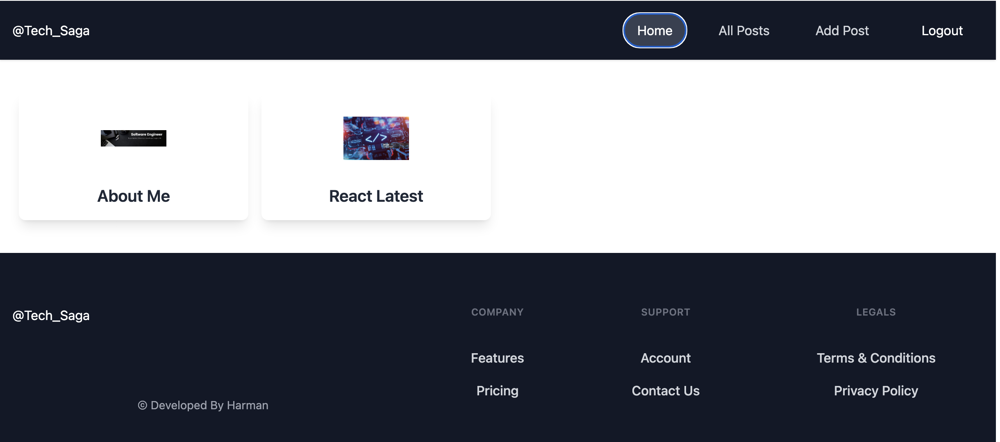
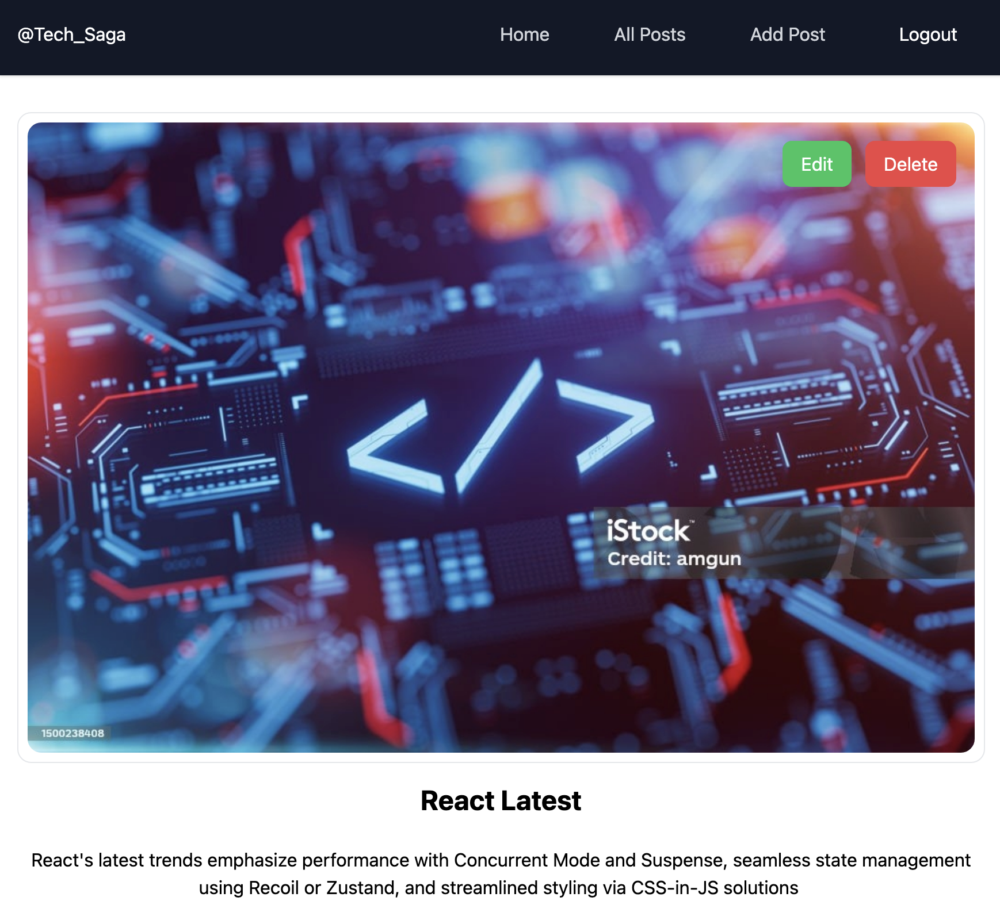
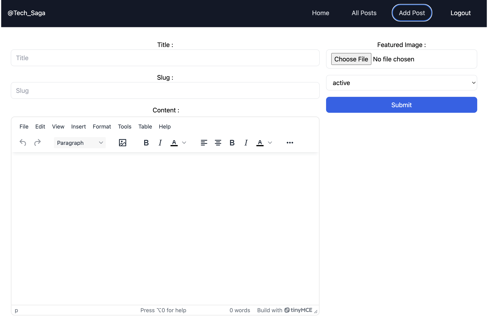
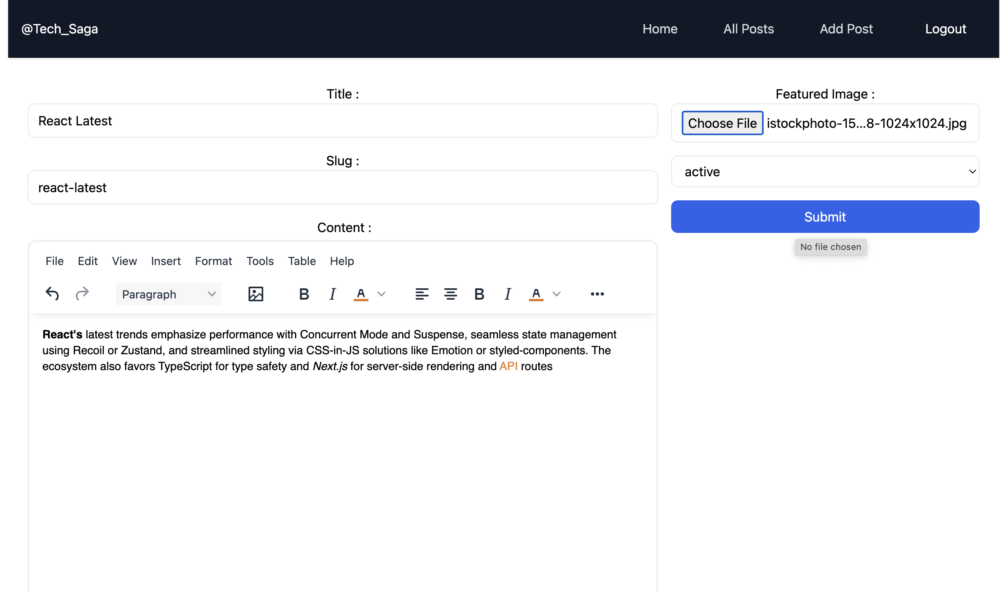
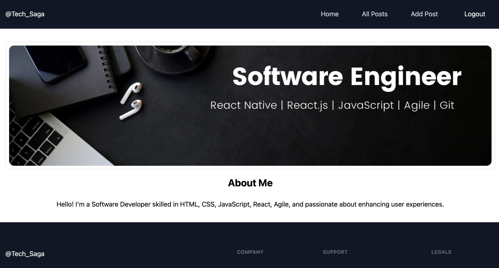
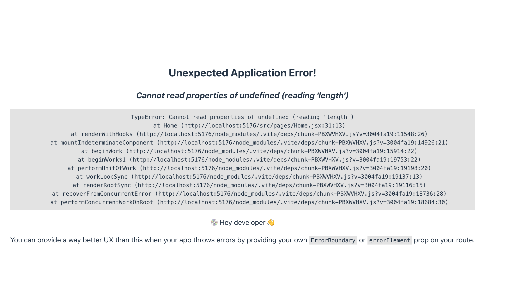
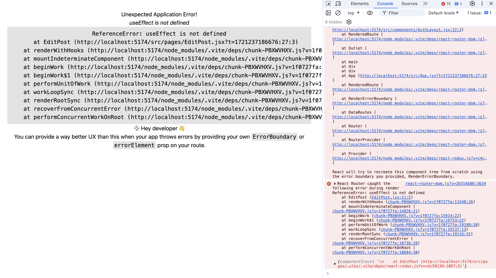

  <h1>
     Welcome to Tech Saga! 
  </h1>

**Features**

***User Authentication**: Login and signup functionalities securely managed by Appwrite. 
***Post Management**: Users can create, edit, and delete posts. Each post includes a dynamically generated slug based on the title. 
***Rich Text Editing**: Enhanced post creation using TinyMCE for formatting text, including features like bold, italic, and more. 
***Responsive Design**: Implemented with Tailwind CSS for a modern and adaptive UI across devices. 

**Technologies Used:**  

**Frontend**: React.js, Tailwind CSS 
**Backend**: Appwrite 
**State Management**: Redux 
**Form Handling**: React Hook Form 
**Text Edito**r: TinyMCE 
**Content Rendering**: React Parser 

**Usage**

**1.** Login with your credentials or create a new account to start using the blog features. 
**2.** Create, edit, and delete posts as per your requirements. 

**Screenshots**

**Dashboard**

 

**Post Editor**

 

**Add Post**

 

 

**Read Post**

 

**Errors**

 

